# PostgreSQL Performance Monitoring With Grafana

This dashboard helps you to monitor your **PostgreSQL** databases based on database and OS activity. 

>*Before beginning, this dashboards has Database and OS side monitoring panels. For the OS panels, I benefit from exists Grafana Dashboards examples from https://grafana.com/grafana/dashboards but I did not noted, so I can not give any credit rigth now.*

>**Grafana, Telegraf and InfluxDB tools are used for this project. All databases are PostgreSQL 11+ and all database servers' OS is CentOS 7.** 

You can monitor your databases like:
- General database configuration information that may affect your queries like shared_buffers, work_mem, etc.
- Connection information like current connection numbers, plus active, idle connections, etc.
- The most important thing is **replication status** for Postgres. This dashboard gives more information about your database's replication status.
- Checkpoint, cache hit ratio, conflicts, deadlocks, TPS numbers.
- It gives more information about PostgreSQL queries. To use these features you should add pg_stat_statements extension on your databases that you require to monitor.
  - Total duration of queries
  - Statements calls
  - Active queries
  - Most 50 time-consuming queries
  - Most 50 called queries
 
- Table information
  - It gives information about all user tables. 
  - Table bloat information

- Vacuum processes on tables
  - Last vacuumed time, last analyzed time
  - Show vacuum processed instantly

## General View of Performance Monitoring
### PostgreSQL Performance Monitoring Dashboard

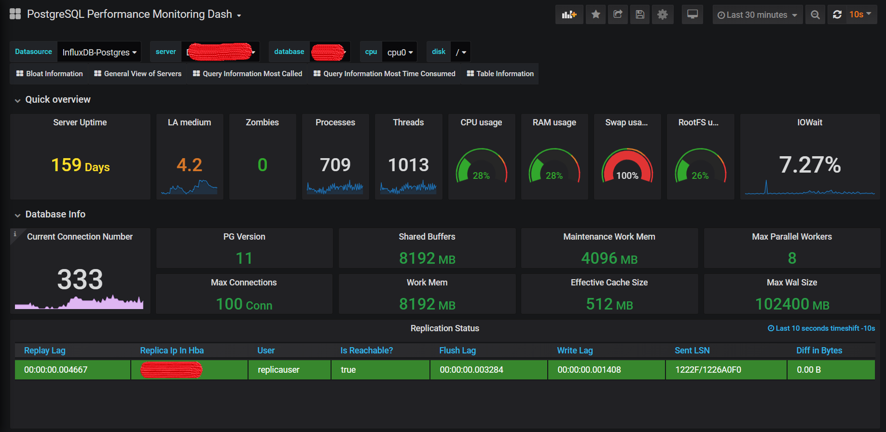
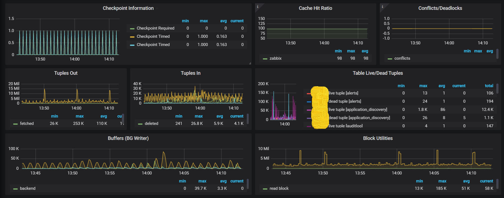
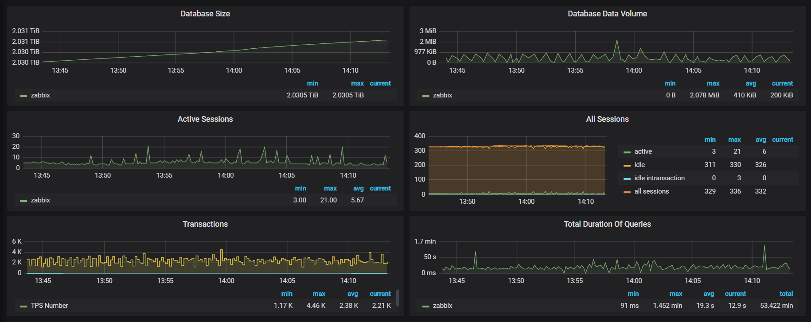
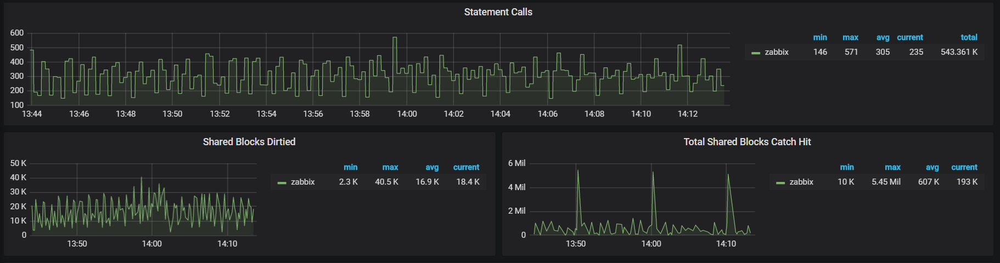


You can see SQL queries on the right side of the panels.

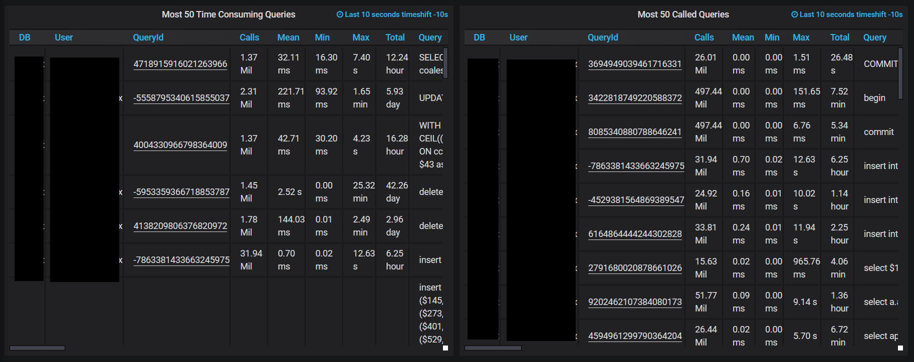

It shows queries' frequences with their own.

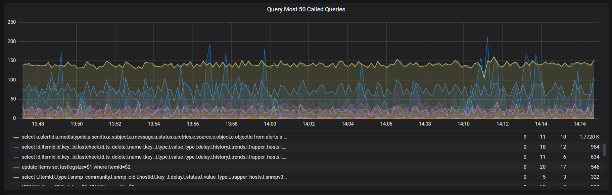

### Table Information Dashboard

General views

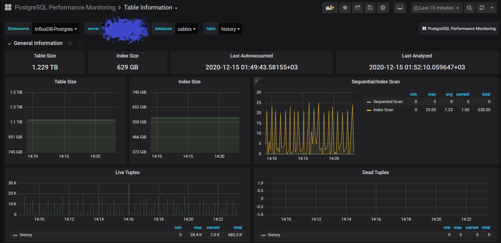
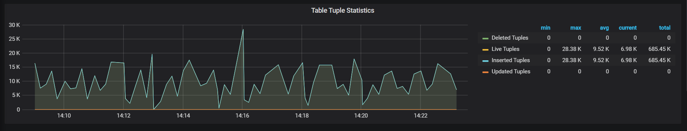

Vacuum details

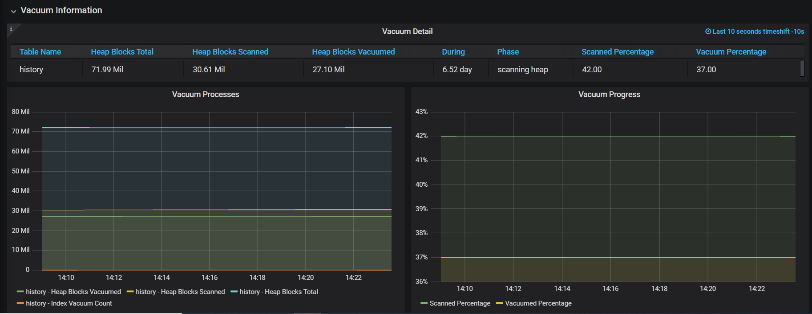

Tables' bloat information with size tolerance

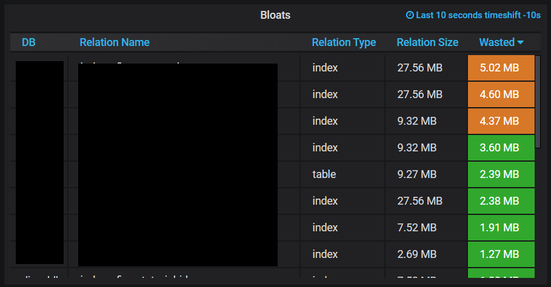

### General View of Servers Dashboard

You can see all servers that all is monitoring

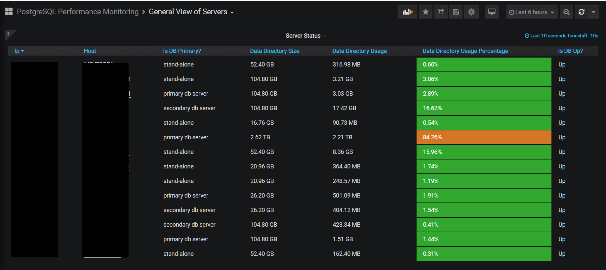

### Most Called Queries Dashboard

Detailed dashboard for most called queries

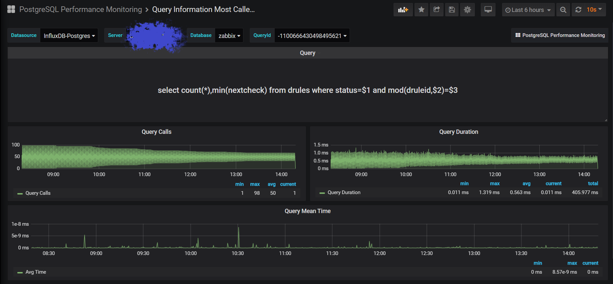

### Time Consumed Queries Dashboard

Detailed dashboard for time consuming queries which is linked with PostgreSQL Performance Monitoring dashboard.

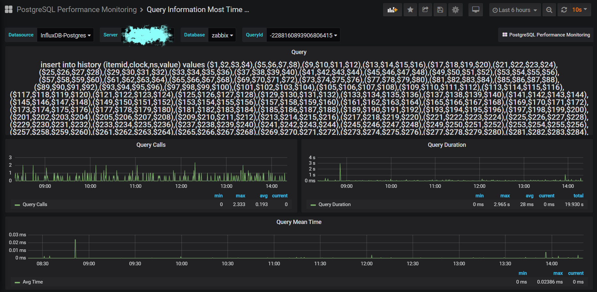

## PostgreSQL monitoring dashboard is also relevant to other five dashboards bellow:

Do not forget, the main dashboard is **PostgreSQL Performance Monitoring Dashboard**. All dashboards are following.

1. PostgreSQL Performance Monitoring Dashboard
2. General View of Servers
3. Query Information Most Called
4. Query Information Most Time Consumed
5. Table Information
6. Bloat Information

>This documents will not direct you to installing InfluxDB, Telegraf or Grafana. If you have already them you can change your configs then you start monitoring your systems.

# InfluxDB Changes

Create new database on InfluxDB as postgres but it is not necessary because InfluxDB database and measurements will be generated automatically. You should generate **telegraf** user with specific password.

```
CREATE USER telegraf WITH PASSWORD '<password>' WITH ALL PRIVILEGES
```

# PostgreSQL Database Changes

Run bellow command on only **postgres** database. 

```
CREATE SCHEMA dba;
CREATE ROLE telegraf LOGIN;
GRANT pg_monitor TO telegraf ;
GRANT USAGE ON SCHEMA dba TO telegraf ;

GRANT EXECUTE ON FUNCTION pg_catalog.pg_hba_file_rules() TO telegraf ;
GRANT select ON pg_catalog.pg_hba_file_rules TO telegraf ;

CREATE VIEW dba.pg_blocking_queries as (SELECT (select datname from pg_database where oid=blocked_locks.database) as datname, blocked_locks.pid     AS blocked_pid,
         blocked_activity.usename  AS blocked_user,
         blocking_locks.pid     AS blocking_pid,
         blocking_activity.usename AS blocking_user,
         blocked_activity.query    AS blocked_statement,
         blocking_activity.query   AS current_statement_in_blocking_process,
         blocked_activity.application_name AS blocked_application,
         blocking_activity.application_name AS blocking_application
   FROM  pg_catalog.pg_locks         blocked_locks
    JOIN pg_catalog.pg_stat_activity blocked_activity  ON blocked_activity.pid = blocked_locks.pid
    JOIN pg_catalog.pg_locks         blocking_locks
        ON blocking_locks.locktype = blocked_locks.locktype
        AND blocking_locks.DATABASE IS NOT DISTINCT FROM blocked_locks.DATABASE
        AND blocking_locks.relation IS NOT DISTINCT FROM blocked_locks.relation
        AND blocking_locks.page IS NOT DISTINCT FROM blocked_locks.page
        AND blocking_locks.tuple IS NOT DISTINCT FROM blocked_locks.tuple
        AND blocking_locks.virtualxid IS NOT DISTINCT FROM blocked_locks.virtualxid
        AND blocking_locks.transactionid IS NOT DISTINCT FROM blocked_locks.transactionid
        AND blocking_locks.classid IS NOT DISTINCT FROM blocked_locks.classid
        AND blocking_locks.objid IS NOT DISTINCT FROM blocked_locks.objid
        AND blocking_locks.objsubid IS NOT DISTINCT FROM blocked_locks.objsubid
        AND blocking_locks.pid != blocked_locks.pid
    JOIN pg_catalog.pg_stat_activity blocking_activity ON blocking_activity.pid = blocking_locks.pid
   WHERE NOT blocked_locks.GRANTED);

GRANT SELECT ON TABLE dba.pg_blocking_queries TO telegraf ;
```
>Blocking queries did not implemented yet into the main dashboard. 

Add new rule for telegraf database user in pg_hba.conf file

```
host    all             telegraf        localhost               trust
```

Some SQL scripts require pg_stat_statements extension. **Don't forget, pg_stat_statement extension requires to restart** 

```
yum install postgresql11-contrib -y
shared_preload_libraries = 'pg_stat_statements'
service postgresql-11 restart
```

# Shell Scripts on PostgreSQL Server

Add **telegraf_based_databases.sh** and **pg_bloats.sh** shell scripts into /etc/telegraf/ folder. 

Create folder to import result of shell scripts.

```
mkdir /etc/telegraf/DO_NOT_DELETE
chown postgres:postgres /etc/telegraf/DO_NOT_DELETE
chmod 755 /etc/telegraf/DO_NOT_DELETE
```

# Add New Cronjob on PostgreSQL Server

telegraf_based_databases.sh script run every 10 seconds.

```
* * * * * /bin/bash -c ' for i in {1..6}; do /bin/bash /etc/telegraf/telegraf_based_databases.sh; sleep 10; done '
```

After all changes restart crontab service

```
systemctl restart crontab 
```

# Telegraf Configurations on PostgreSQL Server

Install telegraf on PostgreSQL server. You can find more information here -> https://docs.influxdata.com/telegraf/v1.16/introduction/installation/ 

After your telegraf installation continue this steps.
PS: If you have already worked with telegraf you may backup your telegraf.conf file.

```
mv /etc/telegraf/telegraf.conf /etc/telegraf/telegraf.conf_old
```

Now, move new telegraf.conf file into /etc/telegraf/

After all changes restart telegraf service

```
systemctl restart telegraf
```

# Check InfluxDB 

Connect InfluxDB and list measurements

```
show measurements
```

# Add Grafana Dashboards

After all configuration we are ready to import JSON files into Grafana. 

The main dashboard is PostgreSQL Performance Monitoring Dashboard. You can find its json file under Grafana JSON Files as **postgresqlPerformanceMonitoringDashboard.json**. First you must add the main dashboard then you import others.

After importing main dashboard you are ready to import other dashboards same way.

That's it.

